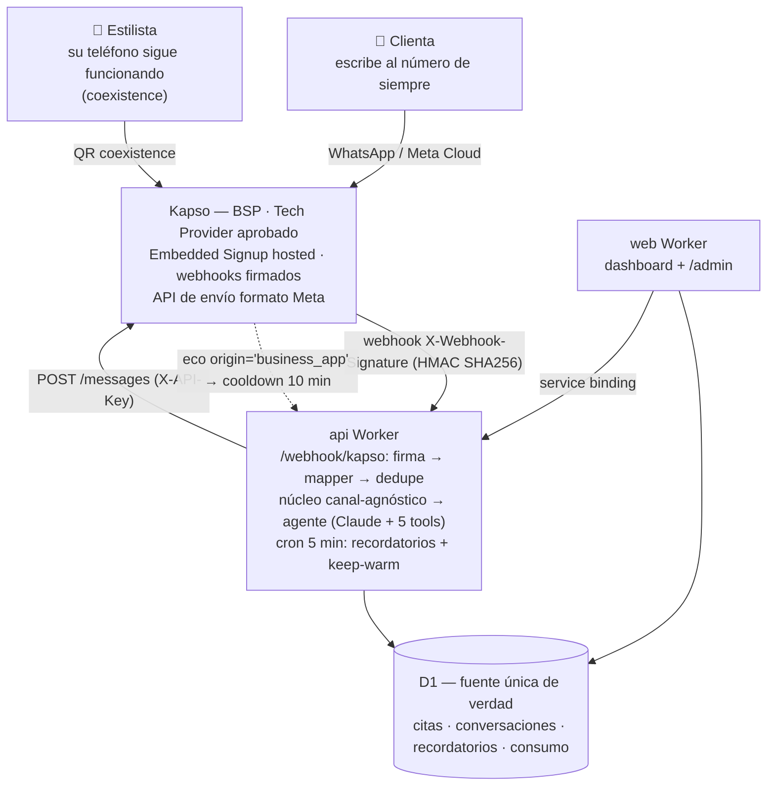

# Plan: Integración Kapso — WhatsApp real para tuhorafácil

**Estado:** aprobado 18-jul-2026, **en pausa hasta resolver el GO/NO-GO** (ver Fase 4).
**Diseño visual:** https://claude.ai/code/artifact/556b6dca-1665-448c-b964-eabe8cdaf459

## Contexto

El Embedded Signup propio estaba bloqueado por el trámite de Tech Provider ante Meta. El 18-jul se decidió usar **Kapso (kapso.com)** como BSP: ellos ya son Tech Provider aprobado, soportan Coexistence (QR desde la WhatsApp Business App, con evento de eco `origin='business_app'`), y su API de envío es **compatible con el formato de Meta Cloud API** (solo cambia URL base y auth). Esto desbloquea WhatsApp real para la demo de octubre a costo $0 (plan Free: 1 número, 2.000 msgs/mes).

**Requisito duro del producto (José, 18-jul): el onboarding es 100 % self-service — no habrá nadie atendiendo registros.** Los setup links de Kapso funcionando sin plan Platform son GO/NO-GO de todo el plan.

Alcance acordado: integración Kapso completa + hardening ligado a ella (firma de webhook, tope duro de gasto). Fuera: recuperación de contraseña, rate limiting general, retención.

## Arquitectura

## Datos técnicos verificados en sus docs

- Webhook: header `X-Webhook-Signature` = HMAC SHA256 (hex) del body crudo con un webhook secret; responder 200 en <10 s (reintentos 10/40/90 s); header `X-Idempotency-Key`.
- Eventos: `whatsapp.message.received` (entrante), `whatsapp.message.sent` con `message.kapso.origin='business_app'` (eco coexistence → nuestro cooldown), estados delivered/read/failed (ignorar).
- Payload propio de Kapso (no Meta): `{ message: { id: wamid, from, type, text: {body}, kapso: {...} }, conversation: {...}, phone_number_id }`. El nombre de perfil de la clienta NO está documentado → fallback `'Clienta'` (como hoy) y se valida en el spike.
- Envío: `POST https://api.kapso.ai/meta/whatsapp/v24.0/{phone_number_id}/messages`, header `X-API-Key`, body idéntico al de Meta (texto y template).

## Fases

### Fase 0 — Prerrequisito (José, en paralelo)
Cuenta Free en app.kapso.ai → obtener **API key** del proyecto y **webhook secret**. Se pasan por archivo local (no chat); se cargan con `wrangler secret put` (`KAPSO_API_KEY`, `KAPSO_WEBHOOK_SECRET`) y en `.dev.vars`/`.dev.vars.example` (necesario para los tipos de `Env` en CI — patrón ya establecido).

### Validación GO/NO-GO (antes de escribir código)
1. Con la cuenta Free: probar `POST /customers` + `POST /setup_links`. Si devuelve un link usable → **GO** con Kapso Pro.
2. Mensaje de José a soporte Kapso: (a) ¿setup links disponibles en Pro?, (b) ¿quién paga las plantillas de Meta con números de clientas?, (c) limitaciones de coexistence.
3. **NO-GO** (links solo en Platform): evaluar plan B (tabla abajo) antes de escribir código.

### Fase 1 — Refactor canal-agnóstico del núcleo del agente (sin cambio de comportamiento)
Hoy `manejarMensajeEntrante`/`manejarEcos` en `apps/api/src/agente/orquestador.ts` están acoplados al formato Meta (`CambioValor`/`MensajeEntrante` de `src/whatsapp/tipos.ts`).
- Extraer a funciones normalizadas: `procesarMensajeEntrante(env, { phoneNumberId, telefono, nombrePerfil, tipo, contenido, waId? })` (pipeline completo actual) y `procesarEco(env, { phoneNumberId, telefonoClienta })` (cooldown).
- `procesarWebhook` (Meta) queda como mapper fino — se conserva para el webhook simulado (`DEMO_PHONE_ID`) y un eventual canal directo futuro.
- Verificar: `pnpm -r check/test`, chat de prueba y webhook simulado iguales que antes.

### Fase 2 — Adaptador de webhook Kapso
- Nueva ruta `POST /webhook/kapso` montada en `src/index.ts`:
  - **Firma** HMAC SHA256 del body crudo (`crypto.subtle`, comparación timing-safe); sin secret → modo degradado con warning. [hardening]
  - 200 inmediato + `waitUntil` (su timeout de 10 s no alcanza para el LLM).
  - Mapper: `message.received` → `procesarMensajeEntrante`; `message.sent` con `origin='business_app'` → `procesarEco`; `whatsapp.phone_number.created` → auto-asociar `wa_phone_number_id` + `wa_estado='activo'`; el resto se ignora.
  - Tipos del payload en `src/kapso/tipos.ts` (subconjunto, como `whatsapp/tipos.ts`).
- **Dedupe por reintentos**: columna `mensajes.wa_id` (nullable, unique) + migración; insert con `onConflictDoNothing`.
- Tests unitarios del mapper y la firma. Verificar local con `curl` firmado contra `wrangler dev`.

### Fase 3 — Envío vía Kapso
- `enviarTexto` (apps/api/src/whatsapp/enviar.ts) prueba en orden: `KAPSO_API_KEY` (URL Kapso + `X-API-Key`) → `WA_ACCESS_TOKEN` (Graph directo, se conserva) → log simulado. Body sin cambios (formato Meta).
- Verificar e2e: webhook del número sandbox → `https://tuhorafacil-api.tuhorafacil.workers.dev/webhook/kapso`; conversación real por WhatsApp contra el sandbox.

### Fase 4 — Conexión self-service + validación de Coexistence
- Paso 4 del onboarding: botón "Conectar tu WhatsApp" → `POST /setup_links` → redirección al flujo hosted (login Meta de la estilista → coexistence → QR) → vuelta a la app → el webhook `phone_number.created` activa la cuenta. **Cero intervención humana.**
- `/admin`: acción manual "conectar WhatsApp" solo como herramienta de soporte/fallback.
- Validación real: número conectado vía setup link → mensaje entrante → agente responde → contestar desde el teléfono → el eco pausa el agente 10 min.

### Fase 5 — Recordatorios reales (gateada por aprobación de plantilla Meta)
- Plantilla con quick-replies Confirmar/Reagendar (creada vía Kapso; aprobación Meta con lead time).
- `enviarPlantilla` en `whatsapp/enviar.ts`; `generarRecordatorios` envía cuando `waEstado='activo'`, marca `estado='enviado'` e incrementa `consumo_mensual.conversaciones_meta`.
- Respuesta de botones llega como `message.received` → se registra en `recordatorios.respuesta`; "reagendar" sigue el flujo normal del agente.

### Fase 6 — Tope duro de gasto (hardening)
- Clave `tope_gasto_usd_mes` en `configuracion` (editable en `/admin`) + gate en el orquestador: si `costo_estimado_usd` del mes ≥ tope → pausa amable (como el límite de mensajes). Test del gate.

## Archivos críticos

`apps/api/src/agente/orquestador.ts` · `apps/api/src/routes/webhook.ts` + nuevo adaptador · `apps/api/src/kapso/tipos.ts` · `apps/api/src/whatsapp/enviar.ts` · `apps/api/src/recordatorios/generar.ts` · `packages/db/src/schema.ts` (+migración `mensajes.wa_id`) · `apps/web/src/routes/admin/*`. Reusar: patrón optional-degrading, `contextoEstilista`, patrón `configuracion`, CI existente.

## Verificación end-to-end

1. Local: tests nuevos (mapper, firma, gate) + suite completa; `curl` firmado simula entrante y eco → respuesta del agente y cooldown en D1 local.
2. Prod sandbox: conversación real por WhatsApp → cita creada visible en el calendario.
3. Prod coexistence: eco desde el teléfono pausa el agente (`conversaciones.agente_pausado_hasta`).
4. Cada fase se commitea por separado y despliega vía CI.

## Costos

$0 durante todo el plan (Free). Pro ($25/mes, 3 números, +$10 c/u) al conectar números reales. Platform ($299/mes, 50 números) recién rentable desde ~30 números. Plantillas: las factura Meta aparte (⚠️ a quién — pregunta abierta a soporte).

## Plan B (si el GO/NO-GO falla)

| Opción | Fee mensual | Por número | Self-service embebido | Notas |
|---|---|---|---|---|
| Kapso Platform | $299 | 50 incl., +$5 | ✅ | El mejor valor del tier "ISV estructurado" |
| 360dialog Partner Starter | $300 (€250) | 5 incl., +$59 | ✅ | Mismo precio, 10× menos números — descartable |
| Gupshup ISV | $0 (self-serve) | markup $0.001/msg | ❓ contactar programa ISV | El candidato barato real |
| YCloud | por confirmar | ❓ | ❓ | Soporta coexistence; ISV por confirmar |
| Tech Provider propio | $0 | $0 | ✅ (se construye) | Meses de trámite Meta; el plan original |

Contexto: Meta cobra por mensaje (no por conversación) desde ene-2026.

## Limitaciones de Coexistence (nivel Meta — aplican con cualquier proveedor)

- Abrir la WhatsApp Business App al menos **cada 13 días** (y no desinstalarla) o el número se desconecta.
- Al conectar se desvinculan los companion devices; **WhatsApp para Windows/WearOS no soportados** después, y ⚠️ **mensajes desde dispositivos no soportados NO generan webhooks** → si la estilista contesta desde el PC, el cooldown por eco no se activaría. Validar WhatsApp Web en el spike.
- **Números COEX no se pueden migrar entre WABAs** → cambiar de BSP implica desconectar/reconectar cada número.
- Solo números **ya activos** en la Business App; sin check azul (OBA).
- Mensajes libres solo dentro de la ventana de 24 h; plantillas para iniciar conversación.
